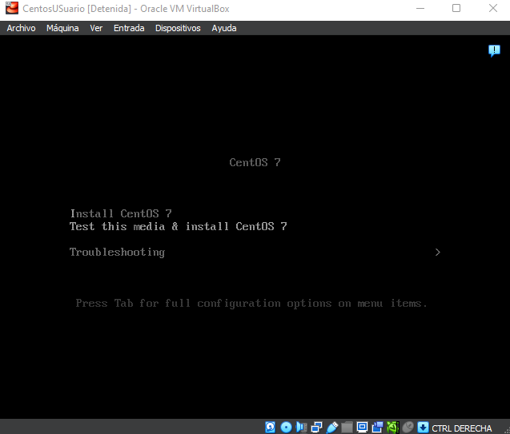
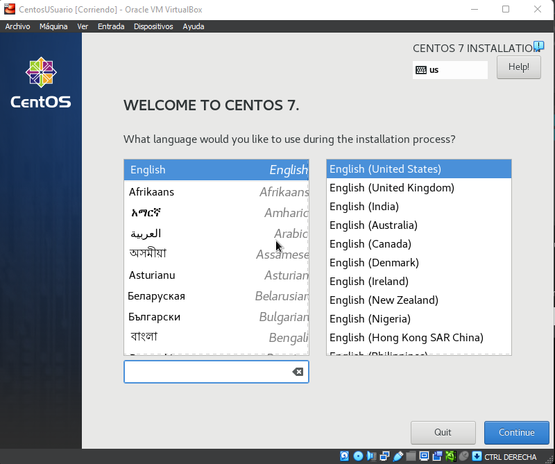
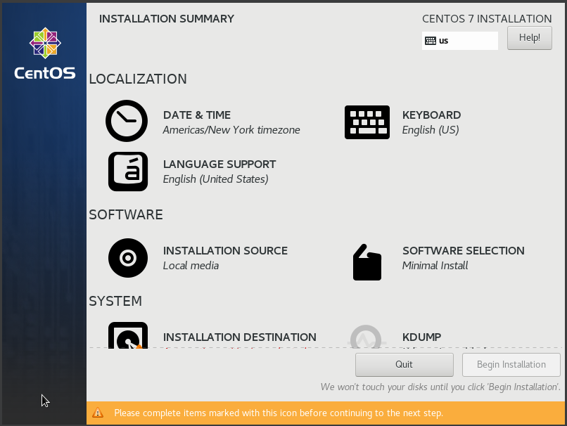
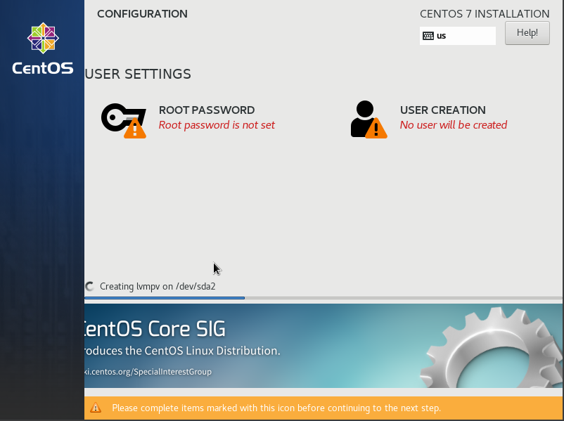

# INSTALACIÓN DE CENTOS 7

La instalación será con VirtualBox.

## DESCARGA

[Descargar la ISO](https://www.centos.org/download/)

## CREANDO MÁQUINA VIRTUAL

Dentro del VirtualBox crearemos una nueva máquina. Le pondremos un nombre, donde se guardará y si se instalará con un archivo ISO.

> VirtualBox añadió una nueva característica llamada "Instalación desatendida" si se activa se encarga de crear el usuario, introducir la clave, el nombre del equipo y el nombre del dominio. Aunque esta función te ahorre tiempo puede dar problemas a la hora de la instalación por lo que si se dan errores, desactivarla.

Declaramos la RAM, los núcleos del procesador y el tamaño en disco que vayamos a usar.

## INSTALACIÓN

Al encender la máquina deberá aparecernos esta pantalla donde iniciaremos la instalación.

> Elegimos el idioma.

> Configuramos cada apartado a nuestra elección.
> Importante: teclado, interfaz gráfica, disco y red.

> Creamos la cuenta root y usuario.

> Después de un rato, reinicia y habrá acabado la instalación.

## ERRORES COMUNES

- Error de credenciales, clave de windows.
  - Desactivar la `Instalación desatendida` de VirtualBox.
- La máquina se queda en negro al iniciarla o no inicia la instalación.
  - La máquina no tiene el archivo ISO, añadirla manualmente en discos y cambiar el posicionamiento de arranque.
- Errores al instalar aplicaciones, actualizaciones.
  - La máquina no tiene conexión de red, añadir tarjeta NAT o puente.
- Al instalarse solo me muestra lineas de comando.
  - Instalaste esa versión, revisa como instalar el entorno gráfico.
