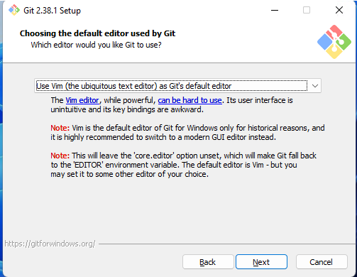

# INSTALACIÓN DE GIT

## DESCARGA

Primero descargaremos el instalador Git desde la página oficial.

[Descargar Git](https://git-scm.com/download/win)

## INSTALACIÓN 1ª PARTE

Durante la instalación entre otras cosas nos preguntará que editor usaremos. En mi caso usaré Visual Studio Code.



Lo demás lo podemos dejar por defecto (a fecha de 25/11/22)

## INSTALACIÓN 2ª PARTE

Una vez instalado la primera parte abriremos un terminal e introduciremos el siguiente comando:

```md
git --version
```

Si todo está correcto, nos devolverá la versión instalada.
Para poder realizar cambios en nuestros repositorios deberemos configurar las variables user.name y user.email. Para ello introduciremos los siguientes comandos:

```java
git config --global user.name "NOMBRE_USUARIO"
git config --global user.email "EMAIL_USUARIO"
```

Deben ser tu usuario y correo de [GitHub](https://github.com/).
Comprueba que los cambios se hayan efectuado con este comando:

```java
git config --list
```

## NUEVO PROYECTO

Git se encarga de buscar cambios que ocurren dentro de un directorio ahora llamado repositorio.

Crearemos un directorio y nos posicionaremos sobre este para configurarlo como repositorio con estos comandos.

```php
#Dentro de la carpeta donde queremos almacenar todo el proyecto.
git init --initial-branch=main
git init -b main 
```

Nos debe indicar que se ha inicializado un repositorio vacío y su rama es la principal. Podemos ver las ramas con el comando:

```md
git status
```

## COMANDOS BÁSICOS

### GIT STATUS

Muestra el estado del proyecto. Ver los cambios que se están haciendo.

### GIT ADD

Revisa si se han producido cambios y los guarda de manera temporal a la espera de la confirmación.

### GIT COMMIT

Después de revisar si hubo cambios se deben confirmar con este comando guardándolos como una nueva versión.

### GIT LOG

Muestra las confirmaciones (commit) anteriores, su mensaje, su hora y autor.

### GIT HELP

Comando básico de ayuda. Para ver las opciones de cada uno de los comandos usa:

```php
git <comando> --help
```
