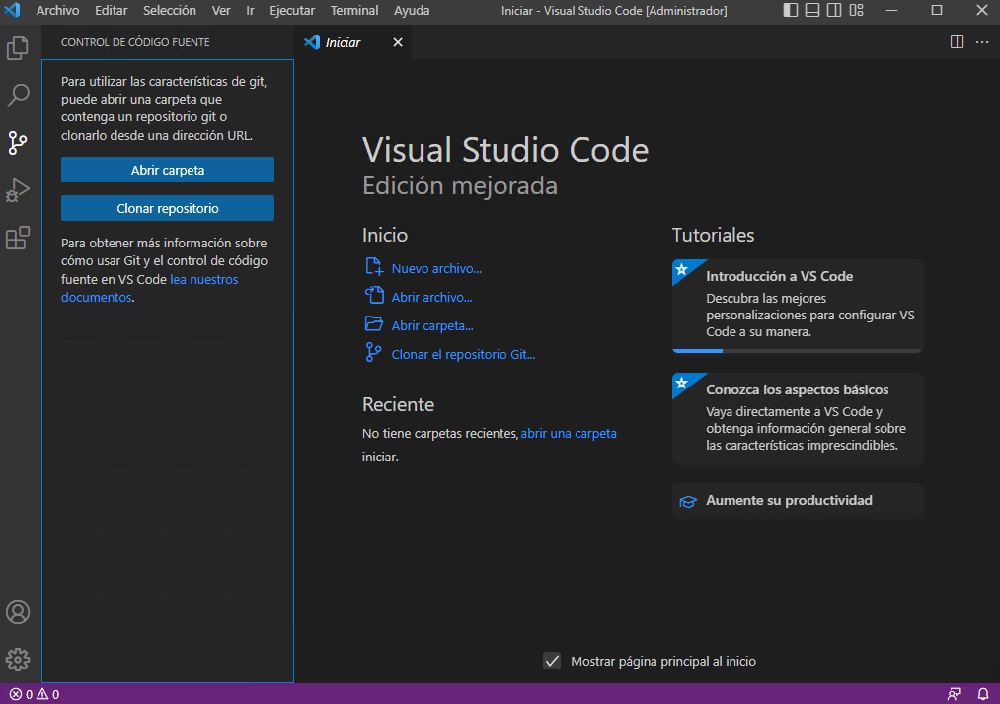
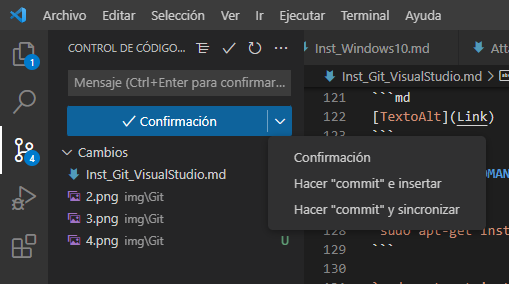

# COMO USAR GITHUB CON VISUAL STUDIO CODE

## DESCARGA

[Descarga Visual Studio Code](https://code.visualstudio.com/download)

[Descarga Git](https://git-scm.com/download/win)

## INSTALACIÓN

Instalamos el Visual Studio Code primero, opciones por defecto.

Después instalamos el Git, cuando nos pregunte que editor nos debe pillar el Visual Studio Code.


Todo lo demás por vale defecto o lo que necesites.

Abrimos el Visual Studio Code, vamos a la pestaña de la izquierda de `Control de código fuente` y ahi decidimos si queremos usar un repositorio que esta en el equipo local (abrir carpeta) o clonar uno que se encuentre en GitHub.



En mi caso ya lo tengo en GitHub así que lo voy a clonar, sino tendrías que crear un repositorio local con Git. [Cómo crear repositorio con Git.](Inst_GIT.md)

Nos pide la URL del repositorio en GitHub. La introducimos y nos dice en que carpeta guardar el repositorio. Y ya podemos modificar nuestro repositorio.

> - Para hacer cambios en el GitHub, recuerda que tienes que introducir el usuario y correo en la configuración de Git.

## MANEJO DE LA INTERFAZ

Se divide en tres partes principalmente.


### Parte Izquierda

Abre una ventana que expande las pestañas que están a la izquierda.
Estas pestañas son:

- Explorador: donde muestra nuestro directorio y los archivos que hay en él.
- Buscador.
- Control de código fuente: lo usaremos para hacer commit, push y pull.
- Ejecución y depuración: para programas.
- Extensiones.

### Parte Baja

Abre una ventana que nos dá varias pestañas:

- Problemas: rápido acceso para corregirlos.
- Salida: para programas.
- Consola de depuración: para programas.
- Terminal: para usar comandos.

### Parte Derecha

Abre una ventana en la que podemos abrir la vista de otro archivo. Simplemente arrastra la pestaña a la ventana o con clic derecho.

## SINTAXIS DE MARKDOWN

### ENCABEZADO

```md
# Encabezado 1
## Encabezado 2
```

### SALTO DE LÍNEA

```md
Dos espacios al terminar  
y pulsar enter.
```

### ÉNFASIS

```md
**negrita**
*cursiva*
***negrita y cursiva***
```

### BLOCKQUOTES

> `>` texto 1
>> `>>` texto 2

### LISTAS ORDENADAS Y DESORDENADAS

```md
1. A
1. B
1. C
```

1. A
1. B
1. C

```md
- A
- B
```

- A
- B

### BLOQUES DE CÓDIGO

```md
```md
Tres comillas + lenguaje y se cierra con otras tres comillas.
```

### IMÁGENES Y LINKS

```md
 Recuerda la exclamación para mostrar la imagen!
```

```md
[TextoAlt](Link)
```

### RESALTAR COMANDOS

```md
`sudo apt-get install`
```

`sudo apt-get install`

## COMO LINKEAR IMÁGENES FÁCILMENTE

Podemos arrastrar la imagen desde el explorador de la izquierda e introducirlo en el código manteniendo pulsado el shift.

También podemos escribir un `.` y ``/` dentro de los paréntesis para poner la ruta.

## CONTROL DE CÓDIGO FUENTE

Cuando hayamos hecho cambios en nuestro repositorio local, debemos confirmarlos para no perderlos. Y después podemos subirlos al GitHub.



>Confirmación = Guardar localmente.  
Hacer commit e insertar = Guardar localmente y hacer push (actualizar en GitHub)  
Hacer commit y sincronizar = Guardar localmente y hacer pull (actualiza tu repositorio local)

Al confirmar nos pedirá que pongamos un comentario acerca del cambio efectuado. Cuando terminemos haz clic en el tick verde arriba derecha.


