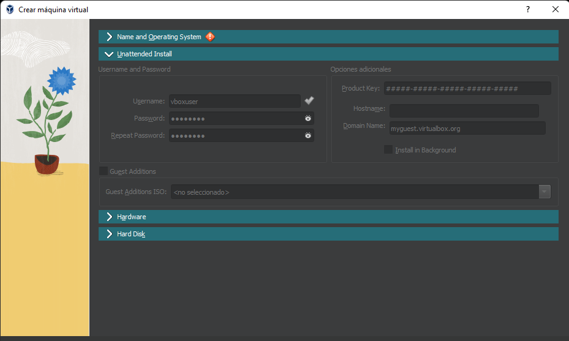
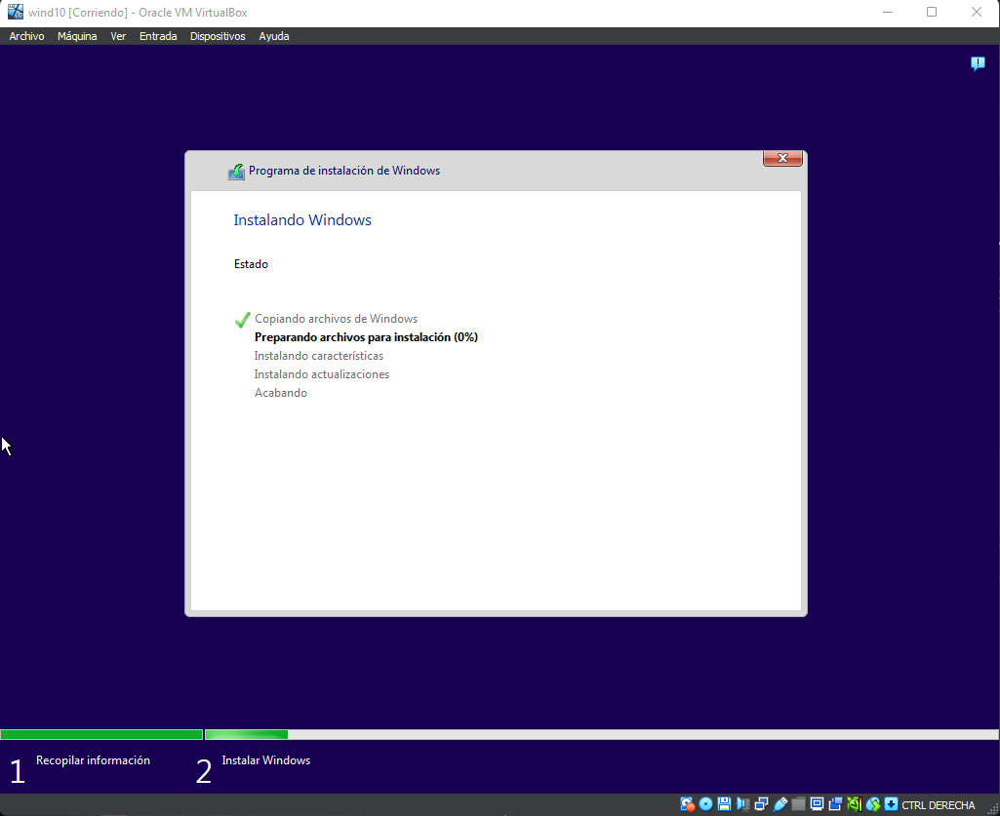
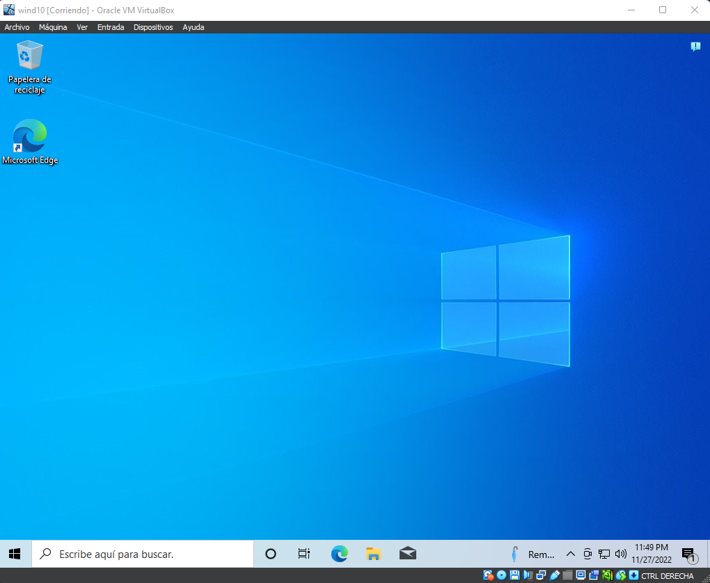

# INSTALACIÓN DE WINDOWS 10

La instalación se hará con VirtualBox.

## DESCARGA

[Descarga el programa de instalación de windows 10.](https://www.microsoft.com/en-us/software-download/windows10)

Este programa nos permite actualizar un equipo o crear una unidad flash, DVD o archivo ISO de windows 10.

## CREANDO MÁQUINA VIRTUAL

Dentro del VirtualBox crearemos una nueva máquina. Le pondremos un nombre, donde se guardará y si se instalará con un archivo ISO.

> VirtualBox añadió una nueva característica llamada "Instalación desatendida" si se activa se encarga de crear el usuario, introducir la clave, el nombre del equipo y el nombre del dominio. Aunque esta función te ahorre tiempo puede dar problemas a la hora de la instalación por lo que si se dan errores, desactivarla.

Declaramos la RAM, los núcleos del procesador y el tamaño en disco que vayamos a usar.

## INSTALACIÓN

Una vez arrancada la máquina debería empezar la instalación automáticamente.

> En este caso al utilizar la instalación desatendida todas las configuraciones que te pide durante la instalación ya no las haría y terminaría instalándose por su cuenta.

## ERRORES COMUNES

- Error de credenciales, clave de windows.
  - Desactivar la `Instalación desatendida` de VirtualBox.
- La máquina se queda en negro al iniciarla o no inicia la instalación.
  - La máquina no tiene el archivo ISO, añadirla manualmente en discos y cambiar el posicionamiento de arranque.
- Errores al instalar aplicaciones, actualizaciones.
  - La máquina no tiene conexión de red, añadir tarjeta NAT o puente.
- Al instalarse solo me muestra lineas de comando.
  - Instalaste esa versión, revisa como instalar el entorno gráfico.
