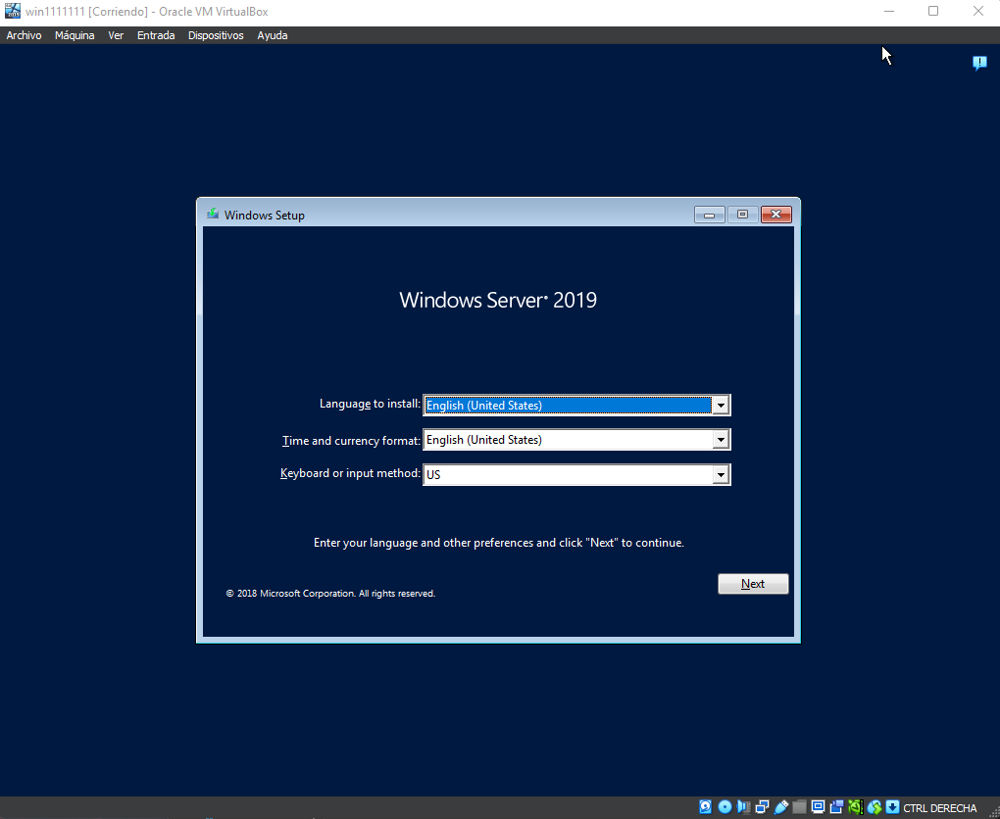
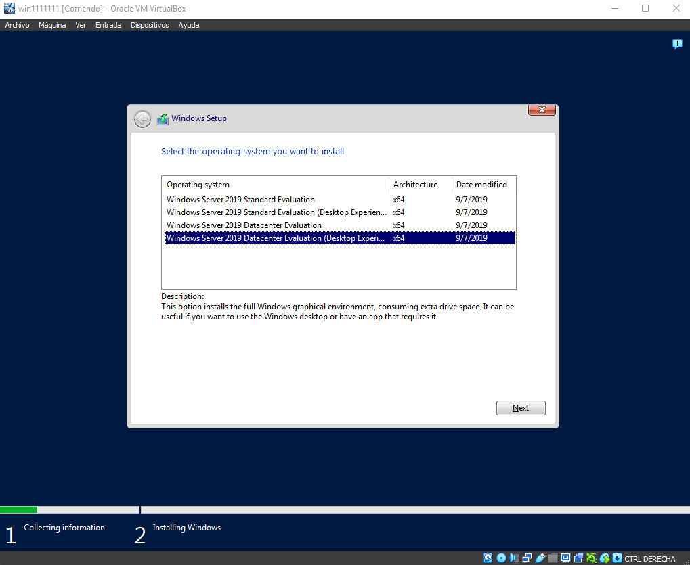
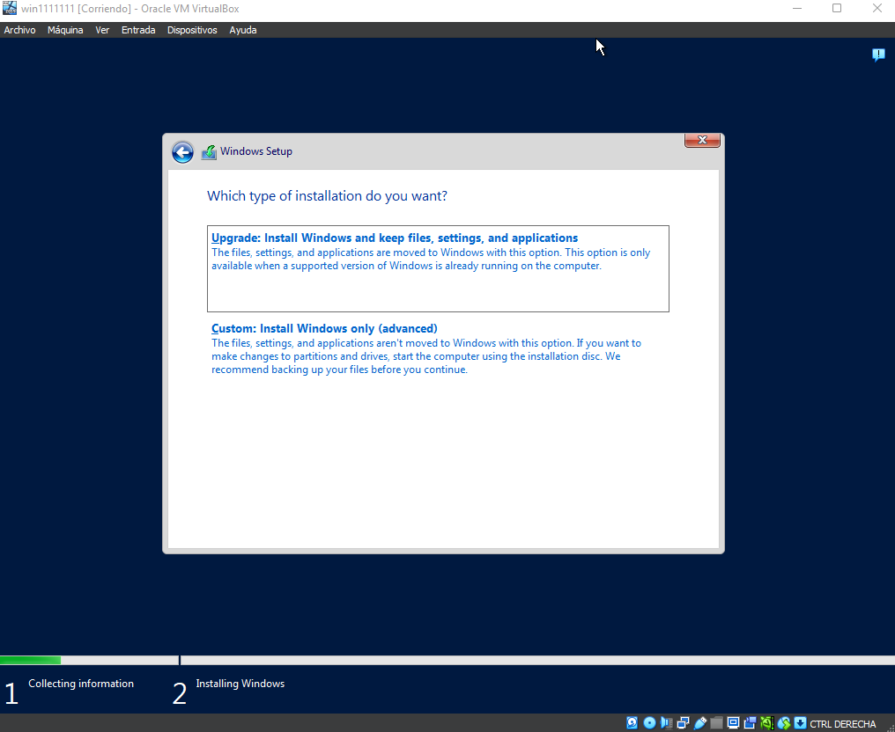
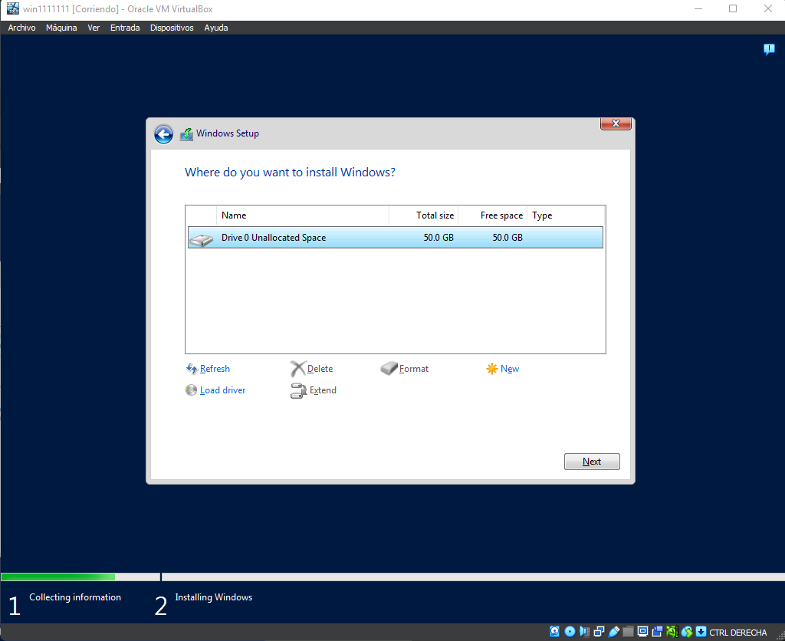
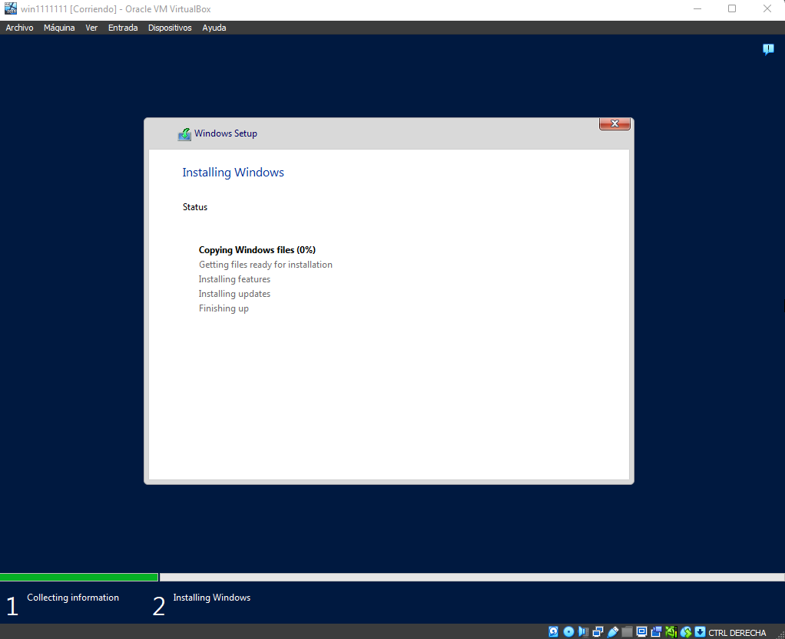
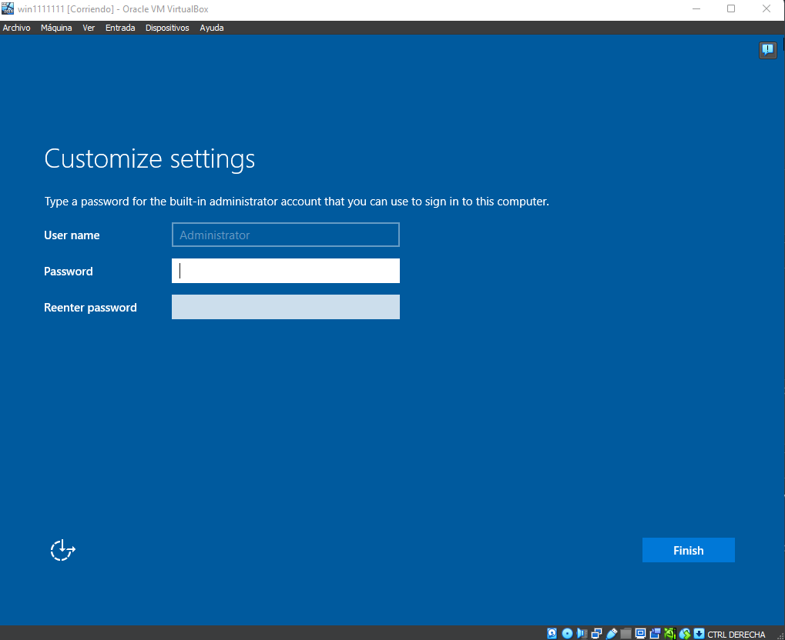
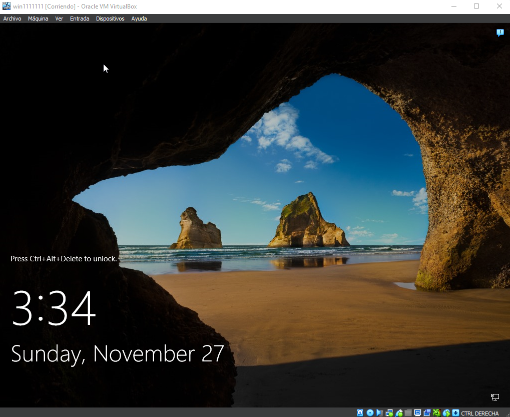

# INSTALACIÓN DE WINDOWS SERVER 2019

La instalación se hará con VirtualBox.

## DESCARGA

[Descargamos la ISO](https://www.microsoft.com/en-us/evalcenter/download-windows-server-2019)

## CREANDO MÁQUINA VIRTUAL

Dentro del VirtualBox crearemos una nueva máquina. Le pondremos un nombre, donde se guardará y si se instalará con un archivo ISO.

>En este caso desactivaremos la función de "Instalación desatendida" porque da problemas a la hora de la instalación.

> Declaramos la RAM, los núcleos del procesador y el tamaño en disco que vayamos a usar.

## INSTALACIÓN

Al iniciar con la ISO debería empezar con la instalación:

> Nos pedirá que versión instalar; Standard o Datacenter y con o sin interfaz gráfica (Desktop Experience)

> Dará dos opciones, actualizar o instalar.

> Al escoger la de instalar, nos dirá en que disco instalarlo y podemos elegir si formatear y crear particiones de los discos.

> Con eso empezaría la instalación.

> Crearemos la cuenta de administrador.

> Y ya hemos terminado.

## ERRORES COMUNES

- Error de credenciales, clave de windows.
  - Desactivar la `Instalación desatendida` de VirtualBox.
- La máquina se queda en negro al iniciarla o no inicia la instalación.
  - La máquina no tiene el archivo ISO, añadirla manualmente en discos y cambiar el posicionamiento de arranque.
- Errores al instalar aplicaciones, actualizaciones.
  - La máquina no tiene conexión de red, añadir tarjeta NAT o puente.
- Al instalarse solo me muestra lineas de comando.
  - Instalaste esa versión, revisa como instalar el entorno gráfico.
